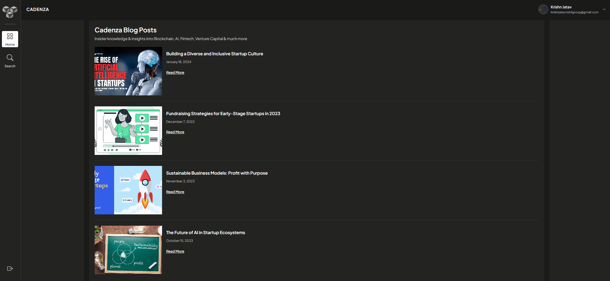

# 🎼 Cadenza - Lead Generation & Business Intelligence Platform

<div align="center">


[](https://opensource.org/licenses/MIT)
[](https://nodejs.org/)
[](https://reactjs.org/)
[](https://www.typescriptlang.org/)
[](https://www.postgresql.org/)

*A sophisticated full-stack web application for lead generation, business intelligence, and professional networking.*

**✨ See it in action with our [visual showcase](#-screenshots) below!**

[🚀 Live Demo](#) • [📖 Documentation](#documentation) • [🐛 Report Bug](../../issues) • [✨ Request Feature](../../issues)

</div>

---

## 📋 Table of Contents

- [✨ Features](#-features)
- [📸 Screenshots](#-screenshots)
- [🏗️ Architecture](#️-architecture)
- [🛠️ Tech Stack](#️-tech-stack)
- [🚀 Quick Start](#-quick-start)
- [📁 Project Structure](#-project-structure)
- [🔧 Configuration](#-configuration)
- [📚 API Documentation](#-api-documentation)
- [🚀 Deployment](#-deployment)
- [🤝 Contributing](#-contributing)
- [📄 License](#-license)

---

## ✨ Features

### 🔐 **Authentication & Security**
- **Multi-tier Authentication**: Local email/password + OAuth (Google & LinkedIn)
- **Role-based Access Control**: Admin and regular user permissions
- **JWT Token Management**: Secure session handling
- **Password Encryption**: bcryptjs for secure password storage

### 🔍 **Advanced Search & Discovery**
- **AI-Powered Search**: Intelligent search across companies and people
- **Advanced Filtering**: Category, location, and custom filters
- **Pagination**: Efficient data loading with customizable page sizes
- **Real-time Results**: Dynamic search with instant feedback

### 📊 **Lead Management**
- **Company Profiles**: Comprehensive business information tracking
- **People Profiles**: Professional networking and contact management
- **Verification System**: Data quality assurance with verification badges
- **Traction Metrics**: Business performance and funding information

### 📝 **Content Management**
- **Blog System**: Rich content creation and management
- **Media Handling**: Image upload and management with fallbacks
- **Publishing Workflow**: Draft, review, and publish content
- **Author Attribution**: User-based content ownership

### 👨‍💼 **Admin Dashboard**
- **User Management**: Admin controls for user accounts
- **Content Moderation**: Blog and profile management
- **Analytics**: System usage and performance metrics
- **Database Management**: Direct access to system data

---

## 📸 Screenshots

### 🏠 Dashboard & Blog Management
<div align="center">
  
  <p><em>Main dashboard showcasing blog posts with modern, clean interface</em></p>
</div>

### 🔍 Company Search & Discovery
<div align="center">
  
  <p><em>Advanced search functionality with filtering and pagination for companies</em></p>
</div>

### 🏢 Detailed Company Profiles
<div align="center">
  
  <p><em>Comprehensive company profiles with business intelligence and metrics</em></p>
</div>

### 🔐 Authentication & Security
<div align="center">
  
  <p><em>Secure authentication with local login and OAuth integration</em></p>
</div>

---

## 🏗️ Architecture


---

## 🛠️ Tech Stack

### **Backend**
- **Runtime**: Node.js 18+
- **Framework**: Express.js
- **Language**: TypeScript
- **Database**: PostgreSQL with Sequelize ORM
- **Authentication**: JWT + Passport.js (Google, LinkedIn OAuth)
- **Security**: bcryptjs, CORS, express-validator

### **Frontend**
- **Framework**: React 18
- **Language**: TypeScript
- **Build Tool**: Vite
- **Routing**: React Router v6
- **UI Framework**: Bootstrap 5 + Bootstrap Icons
- **Styling**: Sass/SCSS
- **HTTP Client**: Axios

### **Development Tools**
- **Package Manager**: npm
- **Process Manager**: nodemon
- **Type Checking**: TypeScript compiler
- **Code Quality**: ESLint (configured)

---

## 🚀 Quick Start

### Prerequisites

Ensure you have the following installed:
- **Node.js** (v18 or higher)
- **PostgreSQL** (v13 or higher)
- **npm** (comes with Node.js)
- **Git**

### 1. Clone the Repository

```bash
git clone https://github.com/yourusername/cadenza.git
cd cadenza
```

### 2. Database Setup

```bash
# Start PostgreSQL service
# Create database (if not using auto-creation)
createdb cadenza

# Or use psql
psql -U postgres
CREATE DATABASE cadenza;
\q
```

### 3. Backend Setup

```bash
cd backend

# Install dependencies
npm install

# Configure environment variables
cp .env.example .env
# Edit .env with your database credentials and OAuth keys

# Initialize database and run migrations
npm run db:init

# Start development server
npm run dev
```

The backend server will start on `http://localhost:5000`

### 4. Frontend Setup

```bash
# Open new terminal
cd frontend

# Install dependencies
npm install

# Configure environment variables
cp .env.example .env.development
# Edit .env.development if needed

# Start development server
npm run dev
```

The frontend will start on `http://localhost:3000`

### 5. Access the Application

- **Frontend**: http://localhost:3000
- **Backend API**: http://localhost:5000/api
- **Admin Login**: admin@gmail.com / admin123

---

## 📁 Project Structure

```
cadenza/
├── 📁 screenshots/             # Application screenshots for documentation
├── 📁 docs/                    # Documentation files
├── 📁 backend/                 # Node.js backend application
│   ├── 📁 src/
│   │   ├── 📁 config/         # Database and authentication config
│   │   ├── 📁 controllers/    # Request handlers
│   │   ├── 📁 middlewares/    # Custom middleware
│   │   ├── 📁 models/         # Sequelize models
│   │   ├── 📁 routes/         # API routes
│   │   ├── 📁 utils/          # Utility functions
│   │   └── 📄 app.ts          # Express application entry point
│   ├── 📄 package.json
│   ├── 📄 tsconfig.json
│   └── 📄 .env.example
├── 📁 frontend/               # React frontend application
│   ├── 📁 src/
│   │   ├── 📁 components/     # React components
│   │   │   ├── 📁 admin/      # Admin-specific components
│   │   │   ├── 📁 auth/       # Authentication components
│   │   │   ├── 📁 dashboard/  # Dashboard components
│   │   │   ├── 📁 layout/     # Layout components
│   │   │   └── 📁 search/     # Search components
│   │   ├── 📁 services/       # API service layers
│   │   ├── 📁 styles/         # SCSS stylesheets
│   │   ├── 📁 types/          # TypeScript type definitions
│   │   ├── 📁 utils/          # Utility functions
│   │   └── 📄 App.tsx         # Main React component
│   ├── 📁 public/             # Static assets
│   ├── 📄 package.json
│   ├── 📄 tsconfig.json
│   └── 📄 vite.config.ts
├── 📄 README.md               # Project documentation
├── 📄 LICENSE                 # License file
└── 📄 .gitignore             # Git ignore rules
```

---

## 🔧 Configuration

### Environment Variables

#### Backend (.env)
```env
# Database Configuration
DB_NAME=cadenza
DB_USER=postgres
DB_PASSWORD=your_password
DB_HOST=localhost
DB_PORT=5432

# JWT Configuration
JWT_SECRET=your_super_secret_jwt_key

# OAuth Configuration
GOOGLE_CLIENT_ID=your_google_client_id
GOOGLE_CLIENT_SECRET=your_google_client_secret
LINKEDIN_CLIENT_ID=your_linkedin_client_id
LINKEDIN_CLIENT_SECRET=your_linkedin_client_secret

# Server Configuration
PORT=5000
NODE_ENV=development
FRONTEND_URL=http://localhost:3000
```

#### Frontend (.env.development)
```env
VITE_API_URL=http://localhost:5000/api
```

### OAuth Setup

#### Google OAuth
1. Go to [Google Cloud Console](https://console.cloud.google.com/)
2. Create a new project or select existing
3. Enable Google+ API
4. Create OAuth 2.0 credentials
5. Add authorized redirect URIs:
   - `http://localhost:5000/api/auth/google/callback`

#### LinkedIn OAuth
1. Go to [LinkedIn Developer Portal](https://www.linkedin.com/developers/)
2. Create a new application
3. Add OAuth 2.0 redirect URLs:
   - `http://localhost:5000/api/auth/linkedin/callback`

---

## 📚 API Documentation

### Authentication Endpoints

| Method | Endpoint | Description |
|--------|----------|-------------|
| POST | `/api/auth/register` | User registration |
| POST | `/api/auth/login` | User login |
| GET | `/api/auth/google` | Google OAuth login |
| GET | `/api/auth/linkedin` | LinkedIn OAuth login |

### Company Endpoints

| Method | Endpoint | Description |
|--------|----------|-------------|
| GET | `/api/companies` | Get all companies |
| GET | `/api/companies/search` | Search companies |
| GET | `/api/companies/:id` | Get company by ID |
| POST | `/api/companies` | Create new company (Admin) |
| PUT | `/api/companies/:id` | Update company (Admin) |
| DELETE | `/api/companies/:id` | Delete company (Admin) |

### People Endpoints

| Method | Endpoint | Description |
|--------|----------|-------------|
| GET | `/api/people` | Get all people (Admin) |
| GET | `/api/people/search` | Search people (Admin) |
| GET | `/api/people/:id` | Get person by ID (Admin) |
| POST | `/api/people` | Create new person (Admin) |
| PUT | `/api/people/:id` | Update person (Admin) |
| DELETE | `/api/people/:id` | Delete person (Admin) |

### Blog Endpoints

| Method | Endpoint | Description |
|--------|----------|-------------|
| GET | `/api/blogs` | Get published blogs |
| GET | `/api/blogs/:id` | Get blog by ID |
| POST | `/api/blogs` | Create new blog (Admin) |
| PUT | `/api/blogs/:id` | Update blog (Admin) |
| DELETE | `/api/blogs/:id` | Delete blog (Admin) |

---

## 🚀 Deployment

### Production Build

#### Backend
```bash
cd backend
npm run build
npm start
```

#### Frontend
```bash
cd frontend
npm run build
# Serve the dist/ folder with your preferred web server
```

### Docker Deployment (Optional)

```dockerfile
# Example Dockerfile for backend
FROM node:18-alpine
WORKDIR /app
COPY package*.json ./
RUN npm ci --only=production
COPY dist/ ./dist/
EXPOSE 5000
CMD ["npm", "start"]
```

### Environment-specific Configuration

- **Development**: Uses nodemon and Vite dev servers
- **Production**: Compiled TypeScript and optimized React build
- **Database**: Ensure PostgreSQL is properly configured for production

---

## 🤝 Contributing

We welcome contributions! Please see our [Contributing Guidelines](CONTRIBUTING.md) for details.

### Development Workflow

1. Fork the repository
2. Create a feature branch (`git checkout -b feature/amazing-feature`)
3. Make your changes
4. Run tests and ensure code quality
5. Commit your changes (`git commit -m 'Add amazing feature'`)
6. Push to the branch (`git push origin feature/amazing-feature`)
7. Open a Pull Request

### Code Standards

- **TypeScript**: Strict mode enabled
- **ESLint**: Follow the configured rules
- **Prettier**: Code formatting (if configured)
- **Conventional Commits**: Use conventional commit messages

---

## 📄 License

This project is licensed under the MIT License - see the [LICENSE](LICENSE) file for details.

---

## 🙏 Acknowledgments

- **React Team** for the amazing frontend framework
- **Express.js** for the robust backend framework
- **Sequelize** for the excellent ORM
- **Bootstrap** for the UI components
- **All Contributors** who help make this project better

---

